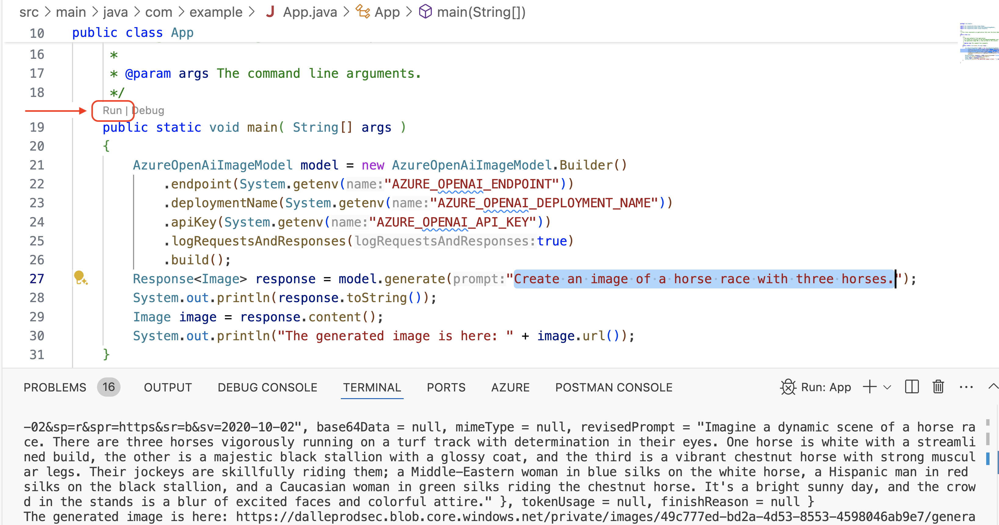

# LangChain4J Dall-E3 Demo

A super simple Java project that utilizes DALL-E3, LangChain4J, and Azure Open AI.


## Table of Contents

- [Installation](#installation)
- [Usage](#usage)
- [Contributing](#contributing)

## Installation

1. Clone the repository:

    ```bash
    git clone https://github.com/sandraahlgrimm/langchain4j-dalle3-demo.git
    ```

2. Create an Azure Open AI account and get the required credentials.

   1. In a new tab, visit [Create and deploy an Azure OpenAI Service resource](https://learn.microsoft.com/en-us/azure/ai-services/openai/how-to/create-resource?pivots=web-portal).
   1. If you want to use the following steps, select the **Portal** tab. Otherwise, just follow the documentation to get the following environment variable values in the way best suited to your needs.

      - `AZURE_OPENAI_ENDPOINT`: Your Azure OpenAI Endpoint.
      - `AZURE_OPENAI_DEPLOYMENT_NAME`: Your Azure Open AI Deployment name.
      - `AZURE_OPENAI_API_KEY`: Your Azure Open AI API key.
      
   1. Follow the steps up to and including the section **Deploy a model**.
   
   1. When you get to the step asking you to **Create new deployment**, use the following substitutions.
   
      1. For **Select a model** select **dall-e-3**.
      1. For **Deployment name** use the same value as your resource group name.

    - [Azure Open AI Documentation](https://learn.microsoft.com/azure/ai-services/openai/how-to/create-resource?pivots=cli)

    1. Ensure the checkmark next to your deployment is selected and select **Open in playground**.
    1. Select **View code**. Keep this screen open and proceed.
 
3. Set up the environment variables in an `.env` file in the root directory of the project with the following content. Adjust the syntax for your operating system if it is not [POSIX compliant](https://posix.opengroup.org/).

```bash
export AZURE_OPENAI_ENDPOINT=<select the copy icon on the Endpoint in Azure AI Studio playground>
export AZURE_OPENAI_DEPLOYMENT_NAME=<your openai deployment name>
export AZURE_OPENAI_API_KEY=<select the copy icon on the API key in Azure AI Studio>
```

   Ensure the `.env` file is evaluated in the shell in which you run the following steps.  To verify the values are set, you can run a command such as `printenv | grep AZURE`.

3. Run the Java App within CodeSpaces, VS Code, IntelliJ IDEA or the IDE of your choice.



   Alternatively, run in the shell with `mvn clean package exec:exec`

## Usage

1. By running the Java project, you can see the image generated in the System output and also the revised prompt generated by Azure Open AI Text Completion.


2. Please, change the prompt or rerun the same prompt multiple times to see the differences.

```json
Prompt: "Create an image of a horse race with three horses."

revisedPrompt = "Imagine a dynamic scene of a horse race.
There are three horses vigorously running on a turf track with determination in their eyes.
One horse is white with a streamlined build, the other is a majestic black stallion with a glossy coat, and the third is a vibrant chestnut horse with strong muscular legs.
Their jockeys are skillfully riding them; a Middle-Eastern woman in blue silks on the white horse, a Hispanic man in red silks on the black stallion, and a Caucasian woman in green silks riding the chestnut horse.
It's a bright sunny day, and the crowd in the stands is a blur of excited faces and colorful attire."
```


## Contributing

Feel free to fork, clone, and contribute to this project. If you have any questions or suggestions, please feel free to open an issue.
